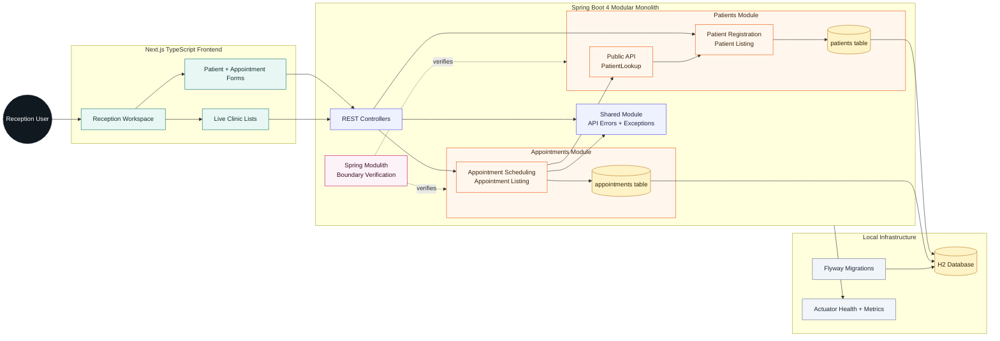

# Clinic Modular Monolith

A small clinic prototype built as a modular monolith. It uses a Spring Boot 4 backend for the domain/API and a Next.js TypeScript frontend for the reception desk experience.

See [Modular Monolith Architecture](../../docs/architecture/modular-monolith.md) for the architectural concepts behind this implementation.

## Stack

- Java 26
- Gradle 9.7.1
- Spring Boot 4.1.1
- Spring Modulith 2.1.1
- Spring Web MVC, Validation, Data JPA, Actuator
- Flyway + H2 in-memory database
- Next.js 16.3.3 + React 19 + TypeScript

## Use Cases

1. Register and list clinic patients.
2. Schedule and list appointments for registered patients.

## Architecture



## Module Boundaries

- `patients` owns patient persistence, patient registration, patient listing, and the public `patients::api` named interface.
- `appointments` owns appointment persistence and scheduling. It calls only `patients::api` to validate a patient.
- `shared` is a closed shared-kernel module. Other modules can use only its `shared::api` named interface.
- `internal` packages contain controllers, application services, repositories, JPA entities, and framework configuration.
- `ModularityTests` verifies Spring Modulith module boundaries.
- `ArchitectureGuidelineTests` prevents direct dependencies on another module's `internal` package.

## Project Layout

```text
src/main/java/com/example/clinic
  appointments/        Appointment module
  patients/            Patient module
  shared/              Shared API errors
src/main/resources
  db/migration/        Flyway schema migrations
src/app/               Next.js App Router
src/components/        Reception UI components
src/lib/               Typed API client
```

## Run Locally

Start the backend API:

```bash
./gradlew bootRun
```

Start the frontend:

```bash
npm install
npm run dev
```

The backend runs on `http://localhost:8080`. The frontend runs on `http://localhost:3000` and calls the backend through `NEXT_PUBLIC_API_BASE_URL`, defaulting to `http://localhost:8080`.

## API Examples

Register a patient:

```bash
curl -X POST http://localhost:8080/patients \
  -H 'Content-Type: application/json' \
  -d '{"fullName":"Maya Patel","email":"maya@example.com","phoneNumber":"+1-555-0100","dateOfBirth":"1990-04-12"}'
```

Schedule an appointment:

```bash
curl -X POST http://localhost:8080/appointments \
  -H 'Content-Type: application/json' \
  -d '{"patientId":1,"doctorName":"Dr. Lee","startsAt":"2026-09-01T10:30:00","reason":"Annual checkup"}'
```

## Verify

Backend tests:

```bash
./gradlew test
```

Frontend type check and production build:

```bash
npm run typecheck
npm run build
```
