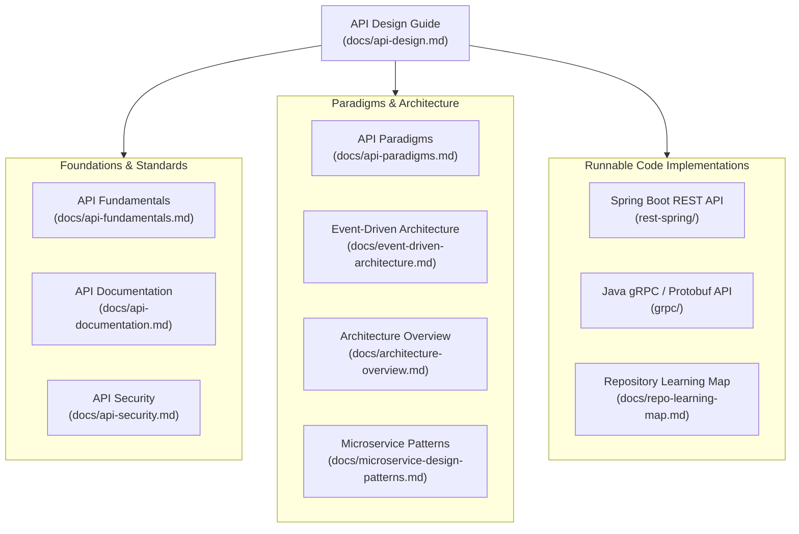
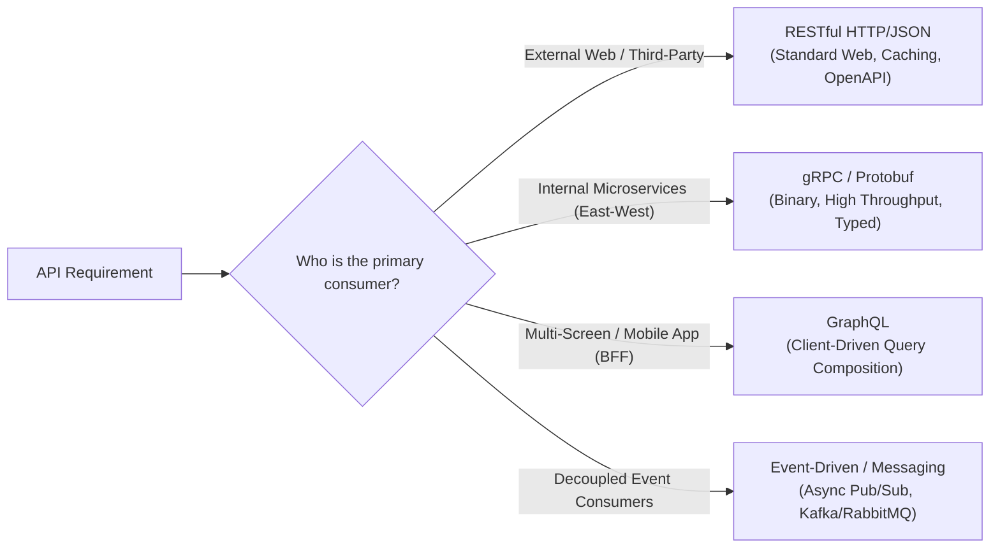
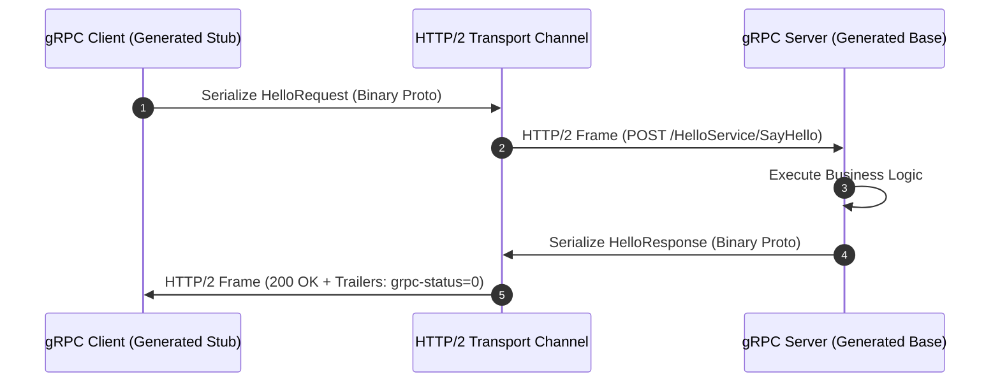
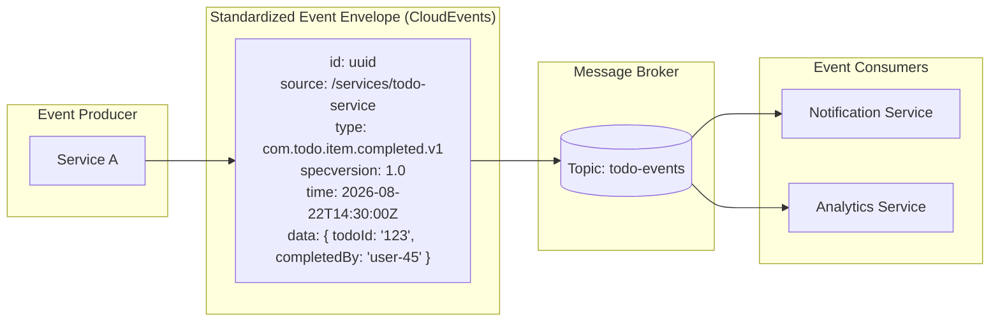

<a id="top"></a>

# API Design Guide

This document serves as the master **API Design** reference and central hub for this repository. It provides comprehensive principles, naming conventions, contract specifications, and design patterns for building robust APIs across various paradigms (REST, RPC/gRPC, GraphQL, and Event-Driven messaging).

---

## Table of Contents

- [API-Related Documentation Index](#api-related-documentation-index)
- [API Fundamentals and Value](#api-fundamentals-and-value)
- [API Design First Principles](#api-design-first-principles)
- [API Paradigms and Selection Guide](#api-paradigms-and-selection-guide)
- [RESTful Resource API Design](#restful-resource-api-design)
  - [URI Structure and Naming Conventions](#uri-structure-and-naming-conventions)
  - [HTTP Methods and Semantics](#http-methods-and-semantics)
  - [HTTP Status Codes Standard](#http-status-codes-standard)
  - [Filtering, Sorting, and Pagination](#filtering-sorting-and-pagination)
  - [Standard Error Handling (RFC 7807)](#standard-error-handling-rfc-7807)
  - [Versioning Strategies](#versioning-strategies)
- [RPC and Contract-First Design (gRPC / Protobuf)](#rpc-and-contract-first-design-grpc--protobuf)
- [Event-Driven and Messaging API Design](#event-driven-and-messaging-api-design)
- [GraphQL and Query-Oriented API Design](#graphql-and-query-oriented-api-design)
- [Cross-Cutting API Design Concerns](#cross-cutting-api-design-concerns)
- [Repository Codebase Implementations](#repository-codebase-implementations)
- [API Design Review Checklist](#api-design-review-checklist)

---

## API-Related Documentation Index

This master guide connects directly to the specialized API documentation across the repository:



### Complete Reference Matrix

| Topic | Document | Focus & Cross-Reference |
| :--- | :--- | :--- |
| **API Fundamentals** | [API Fundamentals](api-fundamentals.md) | Definitions, purpose, coupling, chattiness, and design trade-offs |
| **API Paradigms** | [API Paradigms](api-paradigms.md) | Comparing REST, RPC, GraphQL, and request-response patterns |
| **Event-Driven APIs** | [Event-Driven Architecture](event-driven-architecture.md) | Asynchronous messaging, event contracts, delivery semantics, and Outbox pattern |
| **API Documentation** | [API Documentation](api-documentation.md) | OpenAPI specs, Protobuf IDLs, developer experience, and contract ownership |
| **API Security** | [API Security](api-security.md) | Authentication (OAuth2/OIDC, Basic, mTLS), RBAC/ABAC, and input sanitization |
| **System Architecture** | [Architecture Overview](architecture-overview.md) | System-wide blueprints, North-South vs. East-West traffic, and architecture styles |
| **Microservice Patterns** | [Microservice Design Patterns](microservice-design-patterns.md) | API Gateways, BFFs, Sagas, CQRS, and service communication patterns |
| **Learning Roadmap** | [Repository Learning Map](repo-learning-map.md) | How the sample projects guide architectural learning |
| **REST Implementation** | [rest-spring Project](../rest-spring/README.md) | Spring Boot 3 REST API implementation, DTO validation, and Flyway persistence |
| **RPC Implementation** | [grpc Project](../grpc/README.md) | Schema-first Protobuf contract definitions, generated stubs, and RPC services |

[Back to top](#top)

---

## API Fundamentals and Value

An **API (Application Programming Interface)** is the formal contract through which a software system exposes its capabilities, data, and behavior to consumers (internal modules, external clients, or third-party platforms).

For dedicated foundational reading, see [API Fundamentals](api-fundamentals.md).

### Why APIs Matter
- **Modularity & Decoupling**: Enable systems to evolve their internal persistence and logic without breaking external consumers.
- **Platform Ecosystems**: Turn business capabilities into composable building blocks and monetizable products.
- **Client Agnosticism**: Allow single backends to serve web, mobile, IoT, and CLI clients via uniform contracts.

### Core Architectural Trade-offs in API Design
Every API design choice requires balancing competing architectural forces:

| Force | Architectural Impact | Mitigation Strategy |
| :--- | :--- | :--- |
| **Coupling** | High coupling binds clients tightly to internal server domain models. | Expose purpose-built DTOs and abstract representations rather than internal database schemas. |
| **Chattiness** | Requiring numerous network calls degrades mobile and distributed performance. | Design coarse-grained endpoints, use GraphQL/BFFs, or support batch/bulk operations. |
| **Cognitive Load** | Inconsistent naming and irregular payload structures increase developer friction. | Enforce standard conventions (plural nouns, kebab-case, standard pagination, RFC 7807 error models). |
| **Caching** | Uncached frequent reads waste backend compute and increase latency. | Leverage HTTP caching semantics (`ETag`, `Cache-Control`, `304 Not Modified`) on safe methods (`GET`). |
| **Versioning** | Breaking schema changes break downstream clients unexpectedly. | Design for additive changes and use explicit URI path versioning (`/v1/...`). |

[Back to top](#top)

---

## API Design First Principles

Regardless of protocol or style, well-designed APIs adhere to several core principles:

1. **Contract-First Design**: Define and review the interface specification (OpenAPI, Protobuf IDL, GraphQL Schema, AsyncAPI) before writing implementation code.
2. **Predictability and Consistency**: Use standard naming conventions, consistent error formats, standard pagination models, and predictable URL hierarchies.
3. **Information Hiding**: Decouple the public API contract from internal database schemas, domain entities, or storage layouts. Use dedicated Data Transfer Objects (DTOs).
4. **Defensive Posture**: Validate all inputs at the boundary, enforce strict rate limiting, reject unknown payload properties, and never leak stack traces.
5. **Evolution Without Disruption**: Design for backward and forward compatibility so existing clients do not break when new capabilities are introduced.

[Back to top](#top)

---

## API Paradigms and Selection Guide

For a detailed comparative breakdown, see [API Paradigms](api-paradigms.md) and [Architecture Overview](architecture-overview.md).



| Paradigm | Primary Unit | Serialization | Transport | Primary Fit |
| :--- | :--- | :--- | :--- | :--- |
| **REST** | Resource | JSON, XML | HTTP/1.1, HTTP/2 | Public web APIs, CRUD, third-party integrations |
| **gRPC / RPC** | Remote Method / Action | Protocol Buffers (Binary) | HTTP/2 | Low-latency internal microservices, streaming |
| **GraphQL** | Schema Query / Graph | JSON | HTTP | Frontends requiring flexible aggregation |
| **Event-Driven** | Event / Message | JSON, Avro, Protobuf | AMQP, Kafka, MQTT | Async workflows, broadcast state changes |

[Back to top](#top)

---

## RESTful Resource API Design

REST (Representational State Transfer) structures systems around **resources** identified by URIs and manipulated using standard HTTP methods.

### URI Structure and Naming Conventions

- **Use plural nouns** for collections (e.g., `/todos`, `/users`, `/accounts`). Avoid verbs in URIs.
- **Use kebab-case** for multi-word paths (e.g., `/user-profiles`, `/payment-methods`).
- **Reflect parent-child relationships naturally**:
  - `GET /todos/{todoId}/comments` (Sub-resource belongs to specific parent).
  - Avoid nesting deeper than two levels (e.g., avoid `/users/{id}/orders/{id}/items/{id}/reviews`; instead use `/reviews?itemId={id}`).
- **Use query parameters for non-resource modifiers** (filtering, sorting, searching, pagination).

```http
# Good REST URI Structure
GET    /todos                   -> List todos
POST   /todos                   -> Create a todo
GET    /todos/123               -> Get todo with ID 123
PUT    /todos/123               -> Replace todo 123 completely
PATCH  /todos/123               -> Partially update todo 123
DELETE /todos/123               -> Delete todo 123

# Poor REST URI Structure (Anti-patterns)
GET    /getTodos                -> Contains verb in path
POST   /todos/delete/123        -> Uses POST for deletion
POST   /createTodo              -> RPC-style verb endpoint
```

### HTTP Methods and Semantics

| HTTP Method | Operation | Safe? (Read-only) | Idempotent? (Repeatable) | Standard Success Status |
| :--- | :--- | :--- | :--- | :--- |
| `GET` | Retrieve resource(s) | Yes | Yes | `200 OK` |
| `POST` | Create new resource / trigger processing | No | No | `201 Created` or `202 Accepted` |
| `PUT` | Replace entire resource state | No | Yes | `200 OK` or `204 No Content` |
| `PATCH` | Apply partial modifications | No | No (typically) | `200 OK` or `204 No Content` |
| `DELETE` | Remove resource | No | Yes | `204 No Content` or `200 OK` |
| `HEAD` | Retrieve headers only | Yes | Yes | `200 OK` |
| `OPTIONS` | Inspect allowed HTTP methods | Yes | Yes | `200 OK` or `204 No Content` |

### HTTP Status Codes Standard

Categorize and return standard HTTP status codes:

- **2xx Success**:
  - `200 OK`: Request succeeded with payload.
  - `201 Created`: Resource successfully created; include `Location` header pointing to new resource.
  - `202 Accepted`: Asynchronous request accepted for processing.
  - `204 No Content`: Action succeeded with no response body (e.g., `DELETE`).
- **3xx Redirection**:
  - `301 Moved Permanently` / `302 Found`: Resource relocation.
  - `304 Not Modified`: Cached response is valid (used with `ETag` / `If-None-Match`).
- **4xx Client Errors**:
  - `400 Bad Request`: Malformed syntax, invalid request format.
  - `401 Unauthorized`: Authentication required or token invalid/missing (see [API Security](api-security.md)).
  - `403 Forbidden`: Authenticated, but lacks authorization to perform action.
  - `404 Not Found`: Target resource does not exist.
  - `409 Conflict`: Business state conflict (e.g., duplicate unique key).
  - `422 Unprocessable Content`: Syntax valid, but semantic validation rules failed.
  - `429 Too Many Requests`: Rate limit exceeded; return `Retry-After` header.
- **5xx Server Errors**:
  - `500 Internal Server Error`: Unhandled server exception.
  - `502 Bad Gateway` / `503 Service Unavailable`: Downstream dependency failure or maintenance.
  - `504 Gateway Timeout`: Upstream call exceeded deadline.

### Filtering, Sorting, and Pagination

Standardize query parameters across all collection endpoints:

#### Filtering & Searching
```http
GET /todos?status=COMPLETED&priority=HIGH&search=architecture
```

#### Sorting
```http
GET /todos?sort=dueDate,desc&sort=title,asc
```

#### Pagination Models
1. **Offset-Based Pagination** (Simple, suitable for small datasets):
   ```http
   GET /todos?page=2&size=20
   ```
   *Response envelope:*
   ```json
   {
     "content": [ ... ],
     "pageNumber": 2,
     "pageSize": 20,
     "totalElements": 150,
     "totalPages": 8
   }
   ```
2. **Cursor-Based Pagination** (High-scale, real-time datasets):
   ```http
   GET /todos?cursor=eyJpZCI6MTIzfQ==&limit=20
   ```
   *Response envelope:*
   ```json
   {
     "items": [ ... ],
     "nextCursor": "eyJpZCI6MTQzfQ==",
     "hasMore": true
   }
   ```

### Standard Error Handling (RFC 7807)

Adopt **RFC 7807 (Problem Details for HTTP APIs)** for consistent, structured error responses:

```json
{
  "type": "https://api.example.com/errors/validation-error",
  "title": "Invalid Request Body",
  "status": 422,
  "detail": "The todo description must not exceed 255 characters.",
  "instance": "/todos/456",
  "timestamp": "2026-08-22T14:30:00Z",
  "invalidParams": [
    {
      "name": "description",
      "reason": "Length must be between 1 and 255 characters"
    }
  ]
}
```

### Versioning Strategies

| Strategy | Example | Pros | Cons |
| :--- | :--- | :--- | :--- |
| **URI Path** (Recommended) | `/v1/todos`, `/v2/todos` | Explicit, easy to route and cache, human-friendly | URL changes when version bumps |
| **Custom Header** | `X-API-Version: 2` | Clean URLs | Harder to test in browser, caches must key on header |
| **Accept / Content-Type** | `Accept: application/vnd.app.v2+json` | Follows REST purest standards | Complex client configuration |

[Back to top](#top)

---

## RPC and Contract-First Design (gRPC / Protobuf)

For high-throughput, low-latency East-West microservice communication, RPC with Protocol Buffers provides strong typing and efficient binary payloads.

See the practical implementation in the [`grpc`](../grpc/) project.



### Protobuf Contract Best Practices

1. **Schema-First Specification**:
   ```protobuf
   syntax = "proto3";

   package com.architecture.grpc.todo;

   option java_multiple_files = true;
   option java_package = "com.architecture.grpc.todo";

   service TodoService {
     rpc GetTodo (GetTodoRequest) returns (TodoResponse);
     rpc CreateTodo (CreateTodoRequest) returns (TodoResponse);
   }

   message GetTodoRequest {
     string id = 1;
   }

   message TodoResponse {
     string id = 1;
     string title = 2;
     bool completed = 3;
     int64 created_at_epoch_ms = 4;
   }
   ```
2. **Field Compatibility Rules**:
   - **Never change tag numbers** of existing fields.
   - **Never delete tag numbers**: Mark deleted fields as `reserved` to prevent reuse:
     ```protobuf
     reserved 5, 8 to 10;
     reserved "old_field_name";
     ```
   - Add new fields with new tag numbers (proto3 defaults missing values safely).
3. **gRPC Status Codes**: Use canonical gRPC status codes (`OK`, `INVALID_ARGUMENT`, `NOT_FOUND`, `ALREADY_EXISTS`, `UNAUTHENTICATED`, `DEADLINE_EXCEEDED`).

[Back to top](#top)

---

## Event-Driven and Messaging API Design

Asynchronous APIs define the contract for events and commands published to message brokers (e.g., Kafka, RabbitMQ).

For detailed event patterns, see [Event-Driven Architecture](event-driven-architecture.md).



### Key Event Design Guidelines

1. **Adopt CloudEvents Standard**: Use standard envelope metadata (`id`, `source`, `type`, `time`, `datacontenttype`, `data`).
2. **Differentiate Event Types**:
   - **Domain Event (Fact)**: Something that happened in the past (e.g., `TodoCompletedEvent`).
   - **Command Event**: A request for another service to perform an action (e.g., `SendNotificationCommand`).
3. **Idempotency Keys**: Include unique message IDs and correlation IDs to support deduplication at consumer boundaries.
4. **Schema Evolution with Avro / Schema Registry**: Manage schema compatibility (Backward, Forward, Full) to allow consumers and producers to evolve independently.

[Back to top](#top)

---

## GraphQL and Query-Oriented API Design

GraphQL provides a typed query language enabling clients to request exact data graphs in a single network round-trip.

See comparisons in [API Paradigms](api-paradigms.md).

### Design Rules for GraphQL

- **Design by Domain, Not DB Tables**: Expose graphs representing client workflows rather than mirroring raw SQL relations.
- **Relay-Style Cursor Connections for Pagination**:
  ```graphql
  type Query {
    todos(first: Int, after: String): TodoConnection!
  }

  type TodoConnection {
    edges: [TodoEdge!]!
    pageInfo: PageInfo!
  }
  ```
- **Solve N+1 Query Problem**: Always implement batching and caching mechanisms (e.g., DataLoader pattern) in data fetchers / resolvers.
- **Enforce Query Complexity and Depth Limits**: Protect GraphQL servers against Denial of Service (DoS) attacks caused by recursive or deeply nested queries.

[Back to top](#top)

---

## Cross-Cutting API Design Concerns

### 1. API Validation
- Apply validation at the perimeter using declarative constraints (e.g., Bean Validation / Jakarta Validation in Spring Boot):
  - `@NotNull`, `@NotBlank`, `@Size(min = 1, max = 255)`, `@Pattern`, `@Email`.
- Return clear, granular validation error lists matching RFC 7807.

### 2. API Security Integration
- For comprehensive security guidelines, refer to [API Security](api-security.md).
- **Authentication**: Bearer JWT tokens via OAuth2/OIDC.
- **Authorization**: Role-Based (RBAC) and Attribute-Based (ABAC) checks applied at service use cases.
- **Defense-in-depth**: Sanitize payloads, validate `Content-Type: application/json`, and configure CORS policies strictly.

### 3. API Documentation and Contracts
- For documentation standards, refer to [API Documentation](api-documentation.md).
- Generate live OpenAPI 3.0 / Swagger documentation (`/swagger-ui.html`).
- Maintain Protobuf `.proto` and AsyncAPI files in version control as source-of-truth contracts.

### 4. Rate Limiting and Quotas
- Protect endpoints with rate limiting algorithms (Token Bucket, Leaky Bucket).
- Include standard rate-limiting headers in responses:
  - `X-RateLimit-Limit`: Maximum allowed requests in current window.
  - `X-RateLimit-Remaining`: Remaining request allowance.
  - `X-RateLimit-Reset`: Epoch seconds until quota resets.
  - `Retry-After`: Seconds to wait before retrying (when `429 Too Many Requests` is returned).

[Back to top](#top)

---

## Repository Codebase Implementations

This repository provides hands-on code demonstrating API design patterns:

### 1. RESTful Spring Boot Service ([`rest-spring`](../rest-spring/))
- **Controllers & Routing**: Resource endpoints demonstrating standard CRUD operations and HTTP status codes.
- **Validation**: Jakarta Bean Validation on request DTOs.
- **Data Persistence**: Spring JDBC repository pattern with automated Flyway database schema migrations.
- **Containerization**: Backing services managed via `docker-compose.yml`.

### 2. gRPC RPC Service ([`grpc`](../grpc/))
- **IDL Contract**: Schema-first definition in `hello.proto`.
- **Code Generation**: Automated generation of client stubs and server bases via protobuf Gradle plugins.
- **Testing**: In-process gRPC testing verifying RPC contracts without physical port binding.

### 3. Architecture Roadmap
- See [Repository Learning Map](repo-learning-map.md) for future exercises including OpenAPI integration, gRPC contract evolution, and event-driven Outbox implementations.

[Back to top](#top)

---

## API Design Review Checklist

Use this checklist during design reviews before publishing any API:

- [ ] **Contract-First**: Is the OpenAPI / Protobuf / Schema definition written and peer-reviewed?
- [ ] **Resource Naming**: Are URIs resource-oriented nouns (plural, kebab-case) without verbs?
- [ ] **HTTP Semantics**: Are HTTP methods used according to their safety and idempotency rules?
- [ ] **Status Codes**: Are status codes accurate (e.g., `201` for creation with `Location` header, `204` for no content)?
- [ ] **Error Payloads**: Do error responses follow RFC 7807 Problem Details structure?
- [ ] **Input Validation**: Are boundary constraints enforced on all fields with descriptive error messages?
- [ ] **Pagination & Sorting**: Are large collections paginated with deterministic sorting?
- [ ] **Security**: Are authentication, authorization, rate limiting, and TLS configured?
- [ ] **Compatibility**: Are all changes backward-compatible? Are deprecated fields clearly marked?
- [ ] **Observability**: Are correlation IDs, `traceparent` headers, and structured logs propagated?

[Back to top](#top)
