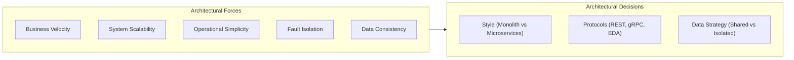
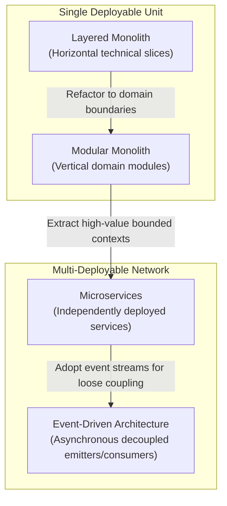
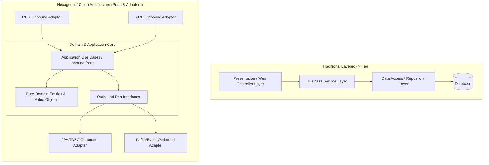
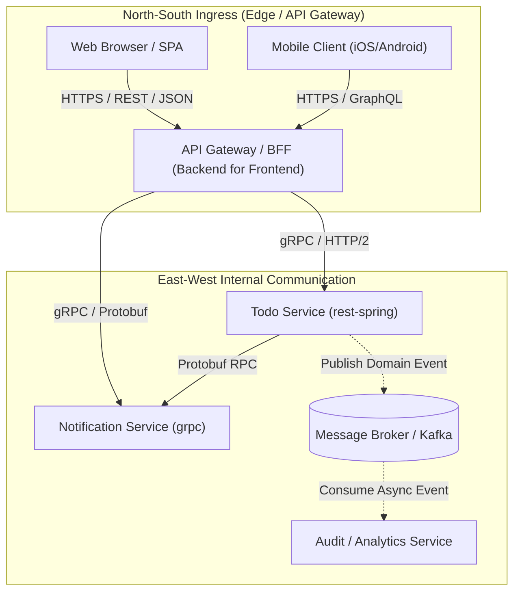
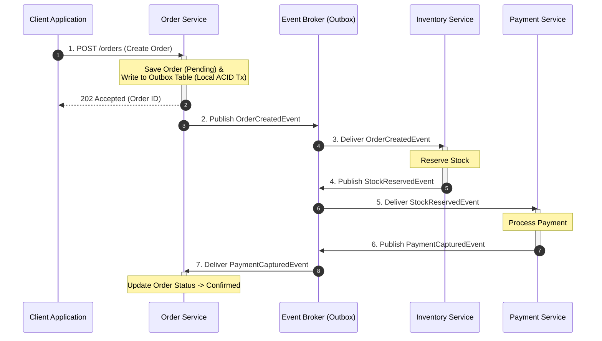
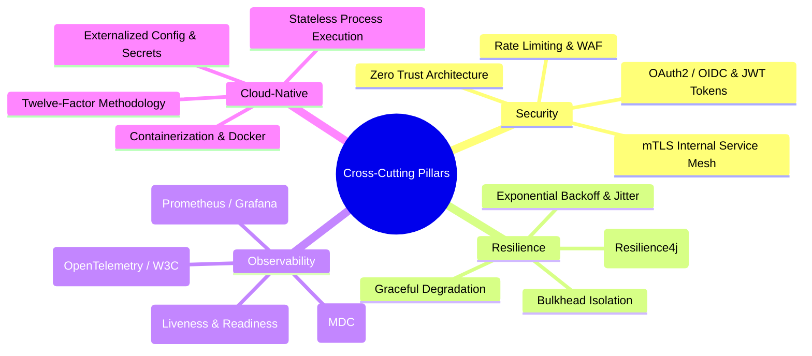
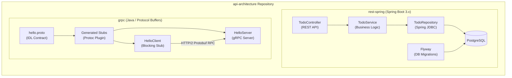
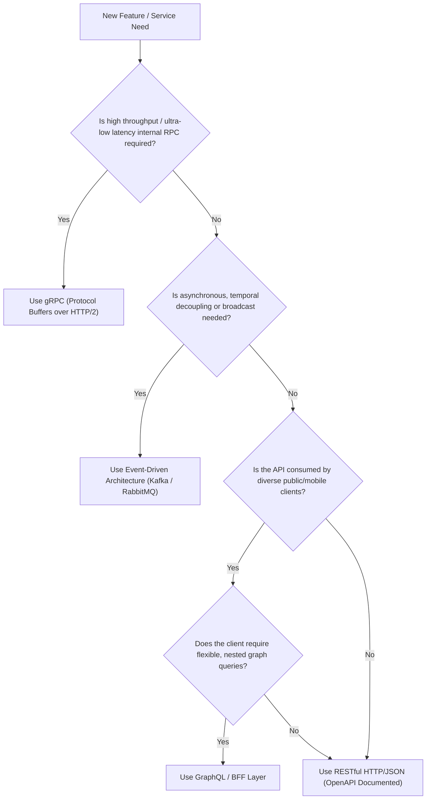

# Architecture Overview

This document provides a comprehensive architectural overview of the concepts, paradigms, design patterns, and concrete code implementations in this repository. It serves as the central architectural blueprint connecting theoretical software architecture principles with practical implementations in [`rest-spring`](../rest-spring/) and [`grpc`](../grpc/).

---

## Table of Contents

- [Architectural Philosophy](#architectural-philosophy)
- [Architectural Styles Continuum](#architectural-styles-continuum)
- [Internal Component Architecture](#internal-component-architecture)
- [API and Inter-Service Communication Taxonomy](#api-and-inter-service-communication-taxonomy)
- [Data Architecture and Distributed Consistency](#data-architecture-and-distributed-consistency)
- [Cross-Cutting Architectural Concerns](#cross-cutting-architectural-concerns)
- [Repository Implementation Mapping](#repository-implementation-mapping)
- [Architectural Decision Framework](#architectural-decision-framework)
- [Documentation Index and Learning Paths](#documentation-index-and-learning-paths)

---

## Architectural Philosophy

Modern software architecture is not about finding a universally "perfect" design; it is the discipline of managing **trade-offs** under specific business, organizational, and operational constraints.

This repository emphasizes four core architectural tenets:

1. **Modularity Before Distribution**: Establish clear domain boundaries and contracts within a single process before introducing network latency, serialization overhead, and distributed failure modes.
2. **Explicit Contracts and Strong Typing**: APIs (whether synchronous REST/gRPC or asynchronous events) represent binding commitments between software boundaries. Schema-first design and contract testing preserve consumer trust.
3. **Decoupled Data Ownership**: Data storage must be owned by the boundary that governs its business logic. Shared mutable databases across boundaries create fragile coupling.
4. **Resilience and Observability as First-Class Citizens**: In distributed networks, latency and partial failures are inevitable. Systems must incorporate timeouts, circuit breakers, structured telemetry, and correlation IDs from day one.

[Back to top](#top)

---

## Architectural Styles Continuum

Software architecture exists on a spectrum from unified single-process systems to highly distributed networks of autonomous micro-runtimes.

### Comparative Trade-Off Matrix

| Dimension | Layered Monolith | Modular Monolith | Microservices | Event-Driven Architecture |
| :--- | :--- | :--- | :--- | :--- |
| **Deployment Unit** | Single artifact (`.jar`, `.war`) | Single artifact (`.jar`) | Multiple autonomous containers | Heterogeneous independent nodes |
| **Process Boundary** | In-process method calls | In-process module interfaces | Network calls (HTTP/gRPC) | Asynchronous message broker |
| **Data Boundary** | Single shared database | Shared DB with logical schemas | Database-per-service | Event log / local projections |
| **Transaction Model** | ACID (Local transactions) | ACID across modules | BASE / Sagas / Eventual | Eventual consistency |
| **Operational Overhead** | Minimal (Single pipeline) | Low (Single deployment) | High (Service discovery, mesh) | High (Brokers, dead-letter queues) |
| **Team Topologies** | Single team / low isolation | Multi-team on single codebase | Autonomous cross-functional teams | Highly autonomous producers/consumers |
| **Failure Blast Radius** | High (Entire app crashes) | High (Process-wide failure) | Low (Isolated service failure) | Very Low (Decoupled by queues) |

[Back to top](#top)

---

## Internal Component Architecture

Within any given service or module boundary, the internal code structure dictates maintainability, testability, and adherence to domain rules.

### Key Internal Architectural Paradigms

- **Layered Architecture (N-Tier)**:
  - Modules are separated by technical function (Controller $\rightarrow$ Service $\rightarrow$ Repository).
  - Simple to implement and standard in small-to-medium Spring Boot applications (as demonstrated in [`rest-spring`](../rest-spring/)).
  - Risk: Domain logic tends to bleed into controllers or database queries, creating an anemic domain model.
- **Hexagonal Architecture (Ports and Adapters)**:
  - Isolates core business domain logic from external technologies, frameworks, and protocols.
  - Inbound ports (use cases) receive commands from REST or gRPC controllers.
  - Outbound ports (interfaces) abstract persistence, event publishing, and third-party APIs.
- **Domain-Driven Design (DDD) Foundations**:
  - **Bounded Context**: Explicit linguistic and conceptual boundaries where a domain model applies.
  - **Aggregates and Entities**: Encapsulated state and business invariants that change together.
  - **Domain Events**: Explicit in-process notifications that communicate state transitions (e.g., `TodoCreatedEvent`).

[Back to top](#top)

---

## API and Inter-Service Communication Taxonomy

Communication patterns define how data and commands transition across network boundaries (North-South client ingress vs. East-West internal traffic).

### Communication Protocols Comparison

| Style | Protocol / Payload | Primary Use Case | Strengths | Trade-offs |
| :--- | :--- | :--- | :--- | :--- |
| **REST** | HTTP/1.1 or HTTP/2 JSON / XML | Public APIs, CRUD, North-South ingress | Universal browser support, HTTP caching, human-readable | Chatty, over/under-fetching, larger payloads |
| **gRPC** | HTTP/2 Protocol Buffers | Internal East-West microservice communication | High throughput, binary serialization, bi-directional streaming | Requires Protobuf tooling, limited direct browser support |
| **GraphQL** | HTTP JSON queries | Aggregated UI views, mobile BFFs | Single query for nested data, client-specified schema | Caching complexity, server-side N+1 query overhead |
| **Event-Driven** | AMQP / Kafka / MQTT Binary / Avro / JSON | Asynchronous business workflows, decoupled integration | Temporal decoupling, high elasticity, fan-out broadcast | Eventual consistency, complex tracing and debugging |

[Back to top](#top)

---

## Data Architecture and Distributed Consistency

When transitioning from monolithic to distributed systems, database design transitions from ACID transactions to distributed data patterns.

### Core Distributed Data Patterns

1. **Database-per-Service**:
   - Each microservice possesses exclusive ownership of its data store. No external service may bypass the API to query database tables directly.
2. **Transactional Outbox Pattern**:
   - Solves the dual-write problem (writing to a database and publishing to a message broker simultaneously).
   - Writes state changes and outbox event records within the same local database transaction. A change-data-capture (CDC) tailer or polling relay publishes events to the broker safely.
3. **Saga Pattern**:
   - Coordinates long-running business transactions spanning multiple microservices without two-phase commit (2PC).
   - **Choreography**: Each service produces and listens to events, making local decisions.
   - **Orchestration**: A centralized orchestrator service directs participating services via command messages.
4. **CQRS (Command Query Responsibility Segregation)**:
   - Separates the write model (handling mutations, validation, and domain invariants) from the read model (optimized denormalized projections for fast UI queries).

[Back to top](#top)

---

## Cross-Cutting Architectural Concerns

Production-grade architectures require robust infrastructure foundations across four critical operational dimensions:

### 1. Security Architecture
- **Zero Trust Model**: Authenticate and authorize every request, regardless of whether it originates outside the network perimeter or inside the cluster.
- **Identity Propagation**: Use OAuth2/OIDC for edge token exchange and pass cryptographically signed claims (JWT) downstream.

### 2. Resilience and Fault Isolation
- **Circuit Breakers**: Prevent cascading outages by fast-failing downstream calls when failure thresholds are exceeded.
- **Timeouts and Deadlines**: Every remote call must have strict timeout thresholds to prevent thread starvation.
- **Idempotency**: All mutating operations and message handlers must handle duplicate deliveries gracefully (via unique idempotency keys).

### 3. Distributed Observability
- **Trace Context Propagation**: Propagate `traceparent` (W3C Trace Context) across HTTP headers, gRPC metadata, and messaging headers to construct end-to-end distributed execution graphs.
- **Correlation IDs**: Inject uniform request/correlation identifiers into logging frameworks (e.g., Mapped Diagnostic Context in Java/SLF4J).

[Back to top](#top)

---

## Repository Implementation Mapping

This repository contains concrete, runnable implementations illustrating key architectural patterns and communication protocols.

### Project Capabilities Summary

| Project | Architectural Role | Key Technologies | Concepts Demonstrated |
| :--- | :--- | :--- | :--- |
| [`rest-spring`](../rest-spring/) | Resource-Oriented Web Service | Spring Boot 3, Spring JDBC, Flyway, PostgreSQL, Docker Compose, Gradle | • Layered architecture • RESTful resource design and validation (`jakarta.validation`) • Schema evolution via Flyway migrations • Containerized backing services (`docker-compose.yml`) • CI/CD pipeline definition (`Jenkinsfile`) |
| [`grpc`](../grpc/) | High-Performance RPC Microservice | Java, gRPC, Protocol Buffers (proto3), Netty | • Schema-first contract definition (`.proto`) • Automated stub and model compilation • Synchronous unary RPC execution over HTTP/2 • In-process gRPC testing and stub lifecycle management |

[Back to top](#top)

---

## Architectural Decision Framework

When designing new components or evolving existing services, use the following decision tree to guide architectural selections:

### Architectural Review Checklist

Before implementing a new architectural boundary:

1. **Domain Boundary**: Does this component represent a distinct bounded context or an unnecessary technical split?
2. **Data Governance**: Who is the single source of truth for the data? Is direct database sharing avoided?
3. **Contract Stability**: Is there a documented schema (OpenAPI, Protobuf, AsyncAPI) with backward-compatibility guidelines?
4. **Resilience Strategy**: Are fallback mechanisms, circuit breakers, and timeout configurations defined?
5. **Observability Readiness**: Are structured logs, health checks (`/actuator/health`), and distributed trace headers configured?

[Back to top](#top)

---

## Documentation Index and Learning Paths

Navigate to deep-dive documentation across the repository:

### Core Architecture Foundations
- [API Design Guide](api-design.md): Master design standards, URI conventions, HTTP semantics, RFC 7807, gRPC, and cross-references.
- [API Fundamentals](api-fundamentals.md): Principles of interface design, coupling, and API qualities.
- [API Paradigms](api-paradigms.md): In-depth comparison of REST, RPC, and GraphQL.
- [API Documentation](api-documentation.md): API contract documentation, OpenAPI specifications, and ownership.
- [API Security](api-security.md): Authentication, authorization, OAuth2, and defense-in-depth patterns.

### Architectural Styles and Patterns
- [Modular Monolith Architecture](modular-monolith.md): In-process modularity, boundary enforcement, and data separation.
- [Microservice Architecture](microservices.md): Distributed systems, Twelve-Factor app alignment, and operational foundations.
- [Microservice Design Patterns](microservice-design-patterns.md): Catalog of decomposition, data, communication, and reliability patterns.
- [Event-Driven Architecture](event-driven-architecture.md): Message brokers, event sourcing, stream processing, and delivery guarantees.
- [Repository Learning Map](repo-learning-map.md): Guided roadmap mapping learning milestones directly to codebase exercises.

[Back to top](#top)
