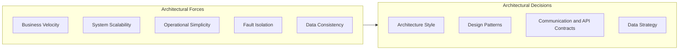
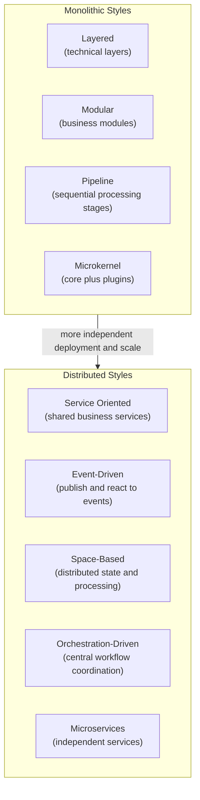
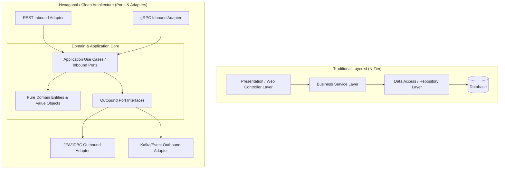
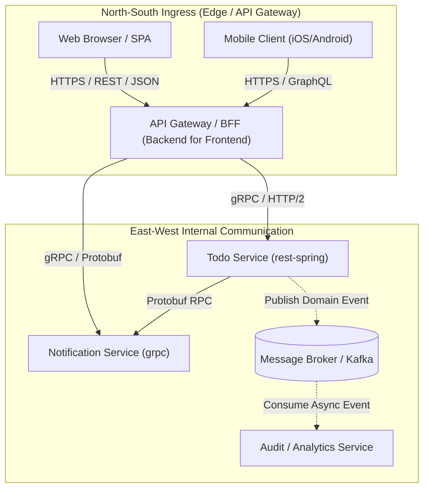
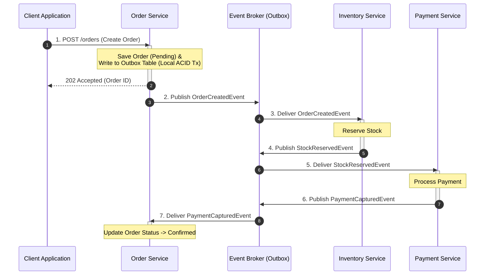
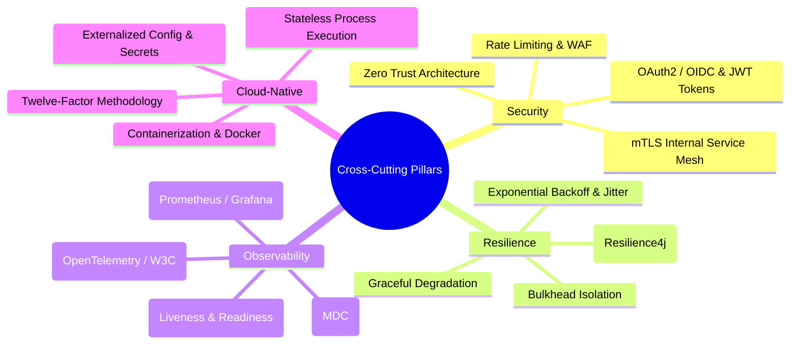
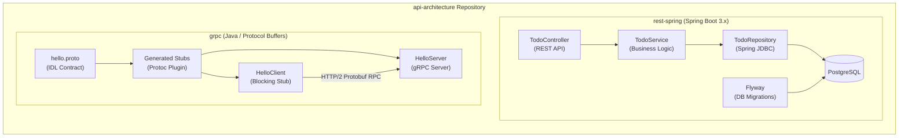
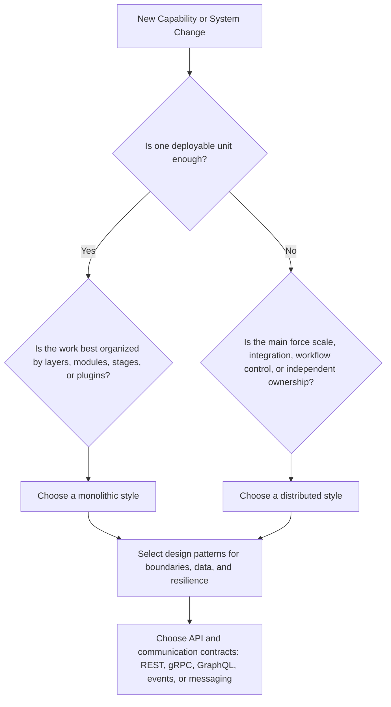

# Architecture Overview

This document provides a comprehensive overview of software architecture styles, design patterns, API design, and concrete code implementations in this repository. It serves as the central blueprint connecting architectural concepts with practical examples in [`rest-spring`](../../apps/rest-spring/) and [`grpc`](../../apps/grpc/).

---

## Table of Contents

- [Architectural Philosophy](#architectural-philosophy)
- [Architecture Styles Landscape](#architecture-styles-landscape)
- [Internal Component Architecture](#internal-component-architecture)
- [Communication and API Taxonomy](#communication-and-api-taxonomy)
- [Data Architecture and Consistency](#data-architecture-and-consistency)
- [Cross-Cutting Architectural Concerns](#cross-cutting-architectural-concerns)
- [Repository Implementation Mapping](#repository-implementation-mapping)
- [Architectural Decision Framework](#architectural-decision-framework)
- [Documentation Index and Learning Paths](#documentation-index-and-learning-paths)

---

## Architectural Philosophy

Modern software architecture is not about finding a universally "perfect" design; it is the discipline of managing **trade-offs** under specific business, organizational, and operational constraints.

This repository emphasizes four core architectural tenets:

1. **Architecture Style Before Technology Choice**: Choose the structural style that fits the system's scale, change rate, team ownership, and operational constraints before choosing frameworks or protocols.
2. **Patterns Solve Recurring Forces**: Use design patterns to address specific problems such as decomposition, integration, resilience, data consistency, and workflow coordination.
3. **Explicit Boundaries and Contracts**: Module, service, API, and data boundaries should be intentional, documented, and protected by clear contracts.
4. **Resilience and Observability as First-Class Citizens**: Systems should be designed with failure handling, tracing, logging, metrics, and operational visibility from the beginning.

[Back to top](#top)

---

## Architecture Styles Landscape

Software architecture styles describe the high-level shape of a system: how responsibilities are divided, how parts communicate, how state is managed, and how the system scales or changes over time.

### Comparative Trade-Off Matrix

| Dimension | Layered | Modular | Pipeline | Microkernel | Distributed Styles |
| :--- | :--- | :--- | :--- | :--- | :--- |
| **Primary Organization** | Technical layers | Business modules | Processing stages | Core plus plugins | Services, events, spaces, or workflows |
| **Best Fit** | Simple business apps | Evolving domains | Data transformation | Extensible products | Scale, integration, or independent ownership |
| **Change Model** | Change by layer | Change by module | Change by stage | Change by plugin | Change by deployable capability |
| **Operational Overhead** | Low | Low | Low to medium | Medium | Medium to high |
| **Main Risk** | Layer coupling | Boundary erosion | Debugging long flows | Plugin complexity | Network, data, and observability complexity |

See [Architecture Styles](styles.md) for concise guidance on what each style is, why it is used, when to choose it, and its weaknesses.

[Back to top](#top)

---

## Internal Component Architecture

Within any given service or module boundary, the internal code structure dictates maintainability, testability, and adherence to domain rules.

### Key Internal Architectural Paradigms

- **Layered Architecture (N-Tier)**:
  - Modules are separated by technical function (Controller $\rightarrow$ Service $\rightarrow$ Repository).
  - Simple to implement and standard in small-to-medium Spring Boot applications (as demonstrated in [`rest-spring`](../../apps/rest-spring/)).
  - Risk: Domain logic tends to bleed into controllers or database queries, creating an anemic domain model.
- **Hexagonal Architecture (Ports and Adapters)**:
  - Isolates core business domain logic from external technologies, frameworks, and protocols.
  - Inbound ports (use cases) receive commands from REST or gRPC controllers.
  - Outbound ports (interfaces) abstract persistence, event publishing, and third-party APIs.
- **Domain-Driven Design (DDD) Foundations**:
  - **Bounded Context**: Explicit linguistic and conceptual boundaries where a domain model applies.
  - **Aggregates and Entities**: Encapsulated state and business invariants that change together.
  - **Domain Events**: Explicit in-process notifications that communicate state transitions (e.g., `TodoCreatedEvent`).

[Back to top](#top)

---

## Communication and API Taxonomy

Communication patterns define how components exchange commands, queries, events, and data. API choices are part of architecture because they shape coupling, latency, ownership, and evolvability.

### Communication and API Styles Comparison

| Style | Protocol / Payload | Primary Use Case | Strengths | Trade-offs |
| :--- | :--- | :--- | :--- | :--- |
| **REST** | HTTP/1.1 or HTTP/2 JSON / XML | Public APIs, CRUD, North-South ingress | Universal browser support, HTTP caching, human-readable | Chatty, over/under-fetching, larger payloads |
| **gRPC** | HTTP/2 Protocol Buffers | Low-latency internal RPC communication | High throughput, binary serialization, bi-directional streaming | Requires Protobuf tooling, limited direct browser support |
| **GraphQL** | HTTP JSON queries | Aggregated UI views, mobile BFFs | Single query for nested data, client-specified schema | Caching complexity, server-side N+1 query overhead |
| **Event-Driven** | AMQP / Kafka / MQTT Binary / Avro / JSON | Asynchronous business workflows, decoupled integration | Temporal decoupling, high elasticity, fan-out broadcast | Eventual consistency, complex tracing and debugging |

[Back to top](#top)

---

## Data Architecture and Consistency

Data architecture defines ownership, consistency, transaction boundaries, and how read models are shaped. Simple systems may rely on local ACID transactions, while distributed styles often require explicit consistency patterns.

### Core Data and Consistency Patterns

1. **Database-per-Service**:
   - A deployable boundary owns its data store. Other boundaries should use contracts, APIs, or events instead of bypassing the owner.
2. **Transactional Outbox Pattern**:
   - Solves the dual-write problem (writing to a database and publishing to a message broker simultaneously).
   - Writes state changes and outbox event records within the same local database transaction. A change-data-capture (CDC) tailer or polling relay publishes events to the broker safely.
3. **Saga Pattern**:
   - Coordinates long-running business transactions across multiple boundaries without two-phase commit (2PC).
   - **Choreography**: Each service produces and listens to events, making local decisions.
   - **Orchestration**: A centralized orchestrator service directs participating services via command messages.
4. **CQRS (Command Query Responsibility Segregation)**:
   - Separates the write model (handling mutations, validation, and domain invariants) from the read model (optimized denormalized projections for fast UI queries).

[Back to top](#top)

---

## Cross-Cutting Architectural Concerns

Production-grade architectures require robust infrastructure foundations across four critical operational dimensions:

### 1. Security Architecture
- **Zero Trust Model**: Authenticate and authorize every request, regardless of whether it originates outside the network perimeter or inside the cluster.
- **Identity Propagation**: Use OAuth2/OIDC for edge token exchange and pass cryptographically signed claims (JWT) downstream.

### 2. Resilience and Fault Isolation
- **Circuit Breakers**: Prevent cascading outages by fast-failing downstream calls when failure thresholds are exceeded.
- **Timeouts and Deadlines**: Every remote call must have strict timeout thresholds to prevent thread starvation.
- **Idempotency**: All mutating operations and message handlers must handle duplicate deliveries gracefully (via unique idempotency keys).

### 3. Distributed Observability
- **Trace Context Propagation**: Propagate `traceparent` (W3C Trace Context) across HTTP headers, gRPC metadata, and messaging headers to construct end-to-end distributed execution graphs.
- **Correlation IDs**: Inject uniform request/correlation identifiers into logging frameworks (e.g., Mapped Diagnostic Context in Java/SLF4J).

[Back to top](#top)

---

## Repository Implementation Mapping

This repository contains concrete, runnable implementations illustrating key architectural patterns and communication protocols.

### Project Capabilities Summary

| Project | Architectural Role | Key Technologies | Concepts Demonstrated |
| :--- | :--- | :--- | :--- |
| [`rest-spring`](../../apps/rest-spring/) | Resource-Oriented Web Service | Spring Boot 3, Spring JDBC, Flyway, PostgreSQL, Docker Compose, Gradle | • Layered architecture • RESTful resource design and validation (`jakarta.validation`) • Schema evolution via Flyway migrations • Containerized backing services (`docker-compose.yml`) • CI/CD pipeline definition (`Jenkinsfile`) |
| [`grpc`](../../apps/grpc/) | High-Performance RPC Communication Sample | Java, gRPC, Protocol Buffers (proto3), Netty | • Schema-first contract definition (`.proto`) • Automated stub and model compilation • Synchronous unary RPC execution over HTTP/2 • In-process gRPC testing and stub lifecycle management |

[Back to top](#top)

---

## Architectural Decision Framework

When designing new components or evolving existing systems, choose the architecture style first, then select patterns and APIs that support that style.

### Architectural Review Checklist

Before implementing a new architectural boundary:

1. **Architecture Style Fit**: Does the selected style match the system's scale, team shape, change rate, and operational maturity?
2. **Data Governance**: Who is the single source of truth for the data? Is direct database sharing avoided?
3. **Pattern Fit**: Which design patterns solve the actual forces in the system without adding unnecessary complexity?
4. **Contract Stability**: Is there a documented schema or interface contract with backward-compatibility guidelines?
5. **Resilience Strategy**: Are fallback mechanisms, circuit breakers, and timeout configurations defined?
6. **Observability Readiness**: Are structured logs, health checks (`/actuator/health`), and trace or correlation headers configured?

[Back to top](#top)

---

## Documentation Index and Learning Paths

Navigate to deep-dive documentation across the repository:

### Architecture Styles and Patterns
- [Architecture Styles](styles.md): Overview of major architecture styles, trade-offs, strengths, weaknesses, and when to choose each style.
- [Microservice Design Patterns](../micro-services/patterns/microservice-design-patterns.md): Catalog of decomposition, data, communication, reliability, observability, and deployment patterns.
- [Repository Learning Map](../learning/repository-learning-map.md): Guided roadmap mapping learning milestones directly to codebase exercises.

### API Design and Interface Topics
- [API Design Guide](../api/design.md): API standards, URI conventions, HTTP semantics, RFC 7807, gRPC, and cross-references.
- [API Fundamentals](../api/fundamentals.md): Principles of interface design, coupling, and API qualities.
- [API Paradigms](../api/paradigms.md): In-depth comparison of REST, RPC, and GraphQL.
- [API Documentation](../api/documentation.md): API contract documentation, OpenAPI specifications, and ownership.
- [API Security](../api/security.md): Authentication, authorization, OAuth2, and defense-in-depth patterns.

[Back to top](#top)
