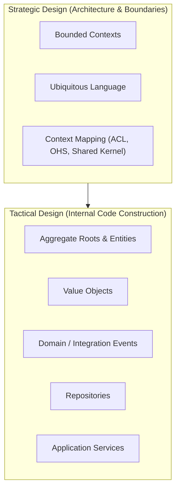
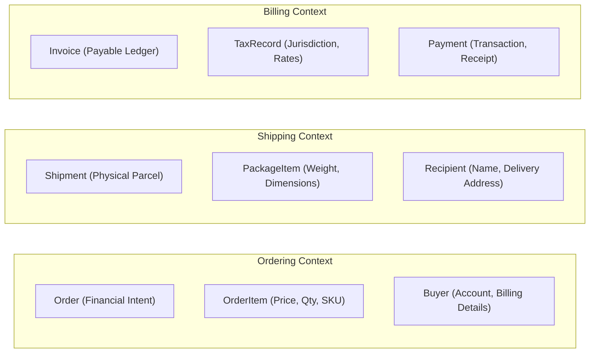
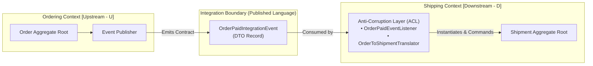
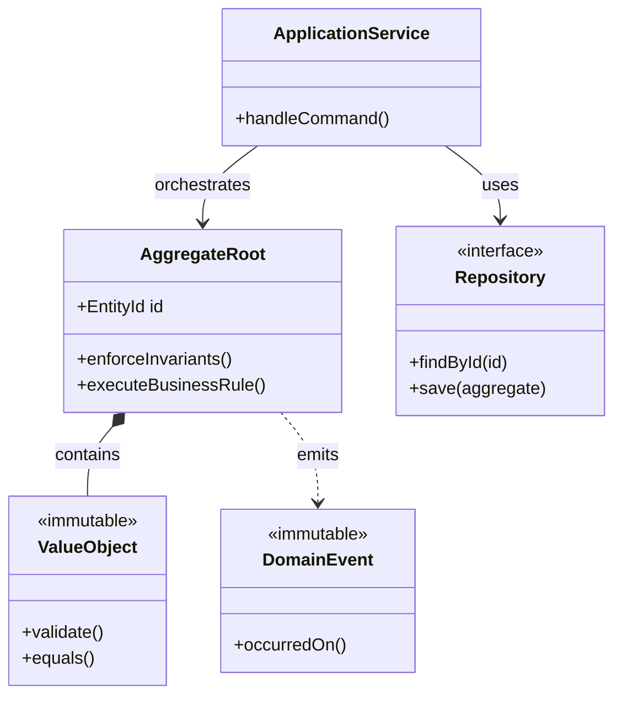
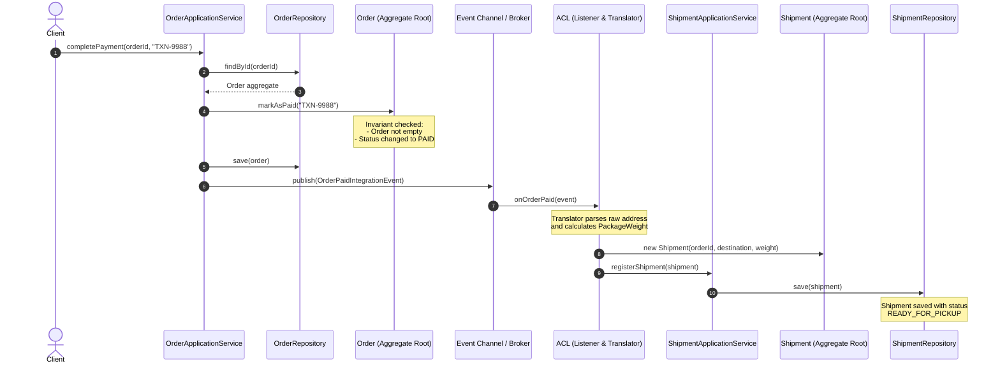

<a id="top"></a>

# Domain-Driven Design

This document provides a comprehensive guide to **Domain-Driven Design (DDD)** in Java. It begins with the core principles, definitions, and an initial event-driven Orders and Payments example (**Example 1**), followed by an in-depth architectural analysis of the "God Entity" anti-pattern, strategic context mapping, and a micro-level implementation of Ordering and Shipping contexts with an Anti-Corruption Layer (**Example 2**).

---

## Table of Contents

- [What is Domain-Driven Design?](#what-is-domain-driven-design)
- [What are Bounded Contexts?](#what-are-bounded-contexts)
- [Tactical Patterns: How to Shape the Model](#tactical-patterns-how-to-shape-the-model)
- [Example 1: Orders and Payments (Tutorial)](#example-1-orders-and-payments-tutorial)
  - [Order Context](#order-context)
  - [Payment Context](#payment-context)
  - [Domain Event](#domain-event)
  - [Event Handler in Order Context](#event-handler-in-order-context)
  - [Step-by-Step Flow](#step-by-step-flow)
  - [Key Takeaways](#key-takeaways)
- [The Core Problem: The Unified &#34;God Entity&#34; Anti-Pattern](#the-core-problem-the-unified-god-entity-anti-pattern)
- [Strategic DDD: Deriving Bounded Contexts &amp; Context Mapping](#strategic-ddd-deriving-bounded-contexts--context-mapping)
  - [Semantic Boundaries &amp; Ubiquitous Language](#semantic-boundaries--ubiquitous-language)
  - [Context Mapping Taxonomy](#context-mapping-taxonomy)
  - [Decision Matrix: Choosing Context Relationships](#decision-matrix-choosing-context-relationships)
  - [Visualizing the Context Map](#visualizing-the-context-map)
- [Tactical DDD: Building Blocks in Java](#tactical-ddd-building-blocks-in-java)
  - [Entities and Aggregate Roots](#entities-and-aggregate-roots)
  - [Value Objects (Records with Self-Validation)](#value-objects-records-with-self-validation)
  - [Repositories](#repositories)
  - [Domain Events vs. Integration Events](#domain-events-vs-integration-events)
  - [Application Services](#application-services)
- [Example 2: Ordering and Shipping Contexts with Anti-Corruption Layer (Micro-Level DDD)](#example-2-ordering-and-shipping-contexts-with-anti-corruption-layer-micro-level-ddd)
  - [Domain Derivation: Ubiquitous Language Breakdown](#domain-derivation-ubiquitous-language-breakdown)
  - [Architecture and Package Structure](#architecture-and-package-structure)
  - [1. Ordering Context Implementation](#1-ordering-context-implementation)
    - [Value Objects (`Money`, `OrderId`, `OrderItem`)](#value-objects-money-orderid-orderitem)
    - [Aggregate Root (`Order`)](#aggregate-root-order)
    - [Repository &amp; Application Service (`OrderApplicationService`)](#repository--application-service-orderapplicationservice)
  - [2. Published Language Contract (`OrderPaidIntegrationEvent`)](#2-published-language-contract-orderpaidintegrationevent)
  - [3. Shipping Context Implementation](#3-shipping-context-implementation)
    - [Value Objects (`PackageWeight`, `DeliveryAddress`)](#value-objects-packageweight-deliveryaddress)
    - [Aggregate Root (`Shipment`)](#aggregate-root-shipment)
    - [Repository &amp; Application Service (`ShipmentApplicationService`)](#repository--application-service-shipmentapplicationservice)
  - [4. Anti-Corruption Layer (ACL) Implementation](#4-anti-corruption-layer-acl-implementation)
    - [The ACL Translator (`OrderToShipmentTranslator`)](#the-acl-translator-ordertoshipmenttranslator)
    - [The ACL Event Listener (`OrderPaidEventListener`)](#the-acl-event-listener-orderpaideventlistener)
  - [5. End-to-End Micro-Level Execution Trace](#5-end-to-end-micro-level-execution-trace)
- [Golden Rules for Java Developers Applying DDD](#golden-rules-for-java-developers-applying-ddd)

[Back to top](#top)

---

### **What is Domain-Driven Design?**

**Domain-Driven Design (DDD)** is a way of building software where the core business domain drives the design. Instead of starting with databases or frameworks, you start with the language and rules of the business and model them in code.

**The goal:** make your code reflect the real-world problem space so developers and domain experts speak the same language.

[Back to top](#top)

---

### **What are Bounded Contexts?**

A **bounded context** is a clear boundary around a part of the domain where terms, rules, and models are consistent.

* Each bounded context has its own **ubiquitous language**.
* Relationships between contexts are identified by looking at **where concepts differ**.
  * Example: “status” in Orders means *Placed, Shipped, Delivered*.
  * “status” in Payments means *Pending, Completed, Failed*.
* Contexts communicate via **events, APIs, or translation layers**, not by sharing entities directly.

[Back to top](#top)

---

### **Tactical Patterns: How to Shape the Model**

DDD provides tactical building blocks:

* **Entities** → have identity (e.g., Order, Payment).
* **Value Objects** → immutable, defined by attributes (e.g., OrderItem).
* **Aggregates** → clusters of entities/objects with a root (e.g., Order as root of OrderItems).
* **Repositories** → abstract persistence.
* **Domain Events** → notify other contexts when something important happens.

[Back to top](#top)

---

### **Example Tutorial: Orders and Payments**

### **Example 1: Orders and Payments (Tutorial)**

#### Order Context

```java
public class Order {
    private final OrderId id;
    private final List<OrderItem> items;
    private OrderStatus status;

    public Order(OrderId id) {
        this.id = id;
        this.items = new ArrayList<>();
        this.status = OrderStatus.PLACED;
    }

    public void addItem(ProductId productId, int quantity) {
        items.add(new OrderItem(productId, quantity));
    }

    public void markAsPaid() {
        if (status != OrderStatus.PLACED) {
            throw new IllegalStateException("Order cannot be paid in current state");
        }
        this.status = OrderStatus.PAID;
    }
}
```

```Java
public enum OrderStatus {
    PLACED, PAID, SHIPPED, DELIVERED
}
```

[Back to top](#top)

---

#### Payment Context

```Java
public class Payment {
    private final PaymentId id;
    private final OrderId orderId;
    private PaymentStatus status;

    public Payment(PaymentId id, OrderId orderId) {
        this.id = id;
        this.orderId = orderId;
        this.status = PaymentStatus.PENDING;
    }

    public void complete() {
        if (status != PaymentStatus.PENDING) {
            throw new IllegalStateException("Payment cannot be completed");
        }
        this.status = PaymentStatus.COMPLETED;
    }
}
```

[Back to top](#top)

---

#### Domain Event

```Java
public class PaymentCompletedEvent {
    private final OrderId orderId;

    public PaymentCompletedEvent(OrderId orderId) {
        this.orderId = orderId;
    }

    public OrderId getOrderId() { return orderId; }
}
```


[Back to top](#top)

---

#### Event Handler in Order Context

```Java
public class PaymentCompletedHandler {
    private final OrderRepository orderRepository;

    public PaymentCompletedHandler(OrderRepository orderRepository) {
        this.orderRepository = orderRepository;
    }

    public void handle(PaymentCompletedEvent event) {
        Order order = orderRepository.findById(event.getOrderId());
        order.markAsPaid();
        orderRepository.save(order);
    }
}
```

[Back to top](#top)

---

#### **Step-by-Step Flow**

1. Order created → status = PLACED
2. Payment initiated → status = PENDING
3. Payment completes → emits PaymentCompletedEvent
4. Order context consumes event → marks order as PAID

[Back to top](#top)

---

#### **Key Takeaways**

* Bounded contexts keep models clean and consistent.
* Aggregates enforce rules inside a context.
* Events connect contexts without leaking models.
* Code mirrors the business domain, not just the database.

[Back to top](#top)

---

## The Core Problem: The Unified "God Entity" Anti-Pattern

Before adopting DDD, enterprise Java applications commonly attempt to model the entire business domain within a single, unified database schema and shared Java entity model.

```java
// ❌ THE ANTI-PATTERN: One massive "Order" entity shared across the entire enterprise
@Entity
@Table(name = "orders")
public class Order {
    @Id 
    @GeneratedValue(strategy = GenerationType.IDENTITY)
    private Long id;
  
    // --- Sales / Checkout fields ---
    private BigDecimal subtotal;
    private BigDecimal discountAmount;
    private String couponCode;
    private String orderStatus; // "PLACED", "PAID", "CANCELLED"

    // --- Billing / Accounting fields ---
    private String taxExemptionNumber;
    private String invoiceNumber;
    private String paymentTransactionId;
    private String paymentStatus; // "PENDING", "COMPLETED", "REFUNDED"

    // --- Warehouse / Logistics / Shipping fields ---
    private Double totalWeightKg;
    private String warehouseBinLocation;
    private String carrierName; // "FEDEX", "UPS", "DHL"
    private String trackingNumber;
    private String deliveryStatus; // "READY_FOR_PICKUP", "IN_TRANSIT", "DELIVERED"
}
```

### Why the Unified Model Collapses

1. **Linguistic Collision**: The word *"Order"* has completely different meanings to different teams:
   - To the **Sales Team**, an Order is a customer purchase agreement and cart snapshot.
   - To the **Billing Team**, an Order is a tax-liable financial debit ledger.
   - To the **Warehouse Team**, an Order is a physical parcel with dimensions, weight, and a shipping label.
2. **Invariant Bloat and Nullable Pollution**: Validating state transitions becomes impossible. Can an `Order` be saved without a `trackingNumber`? Yes in checkout, but No in shipping. Can an `Order` be saved without a `taxExemptionNumber`? Yes in logistics, but No in wholesale billing. Most fields end up nullable, bypassing compiler safety.
3. **High Coupling and Merge Friction**: Changes made for logistics requirements risk breaking checkout calculations or billing workflows.

[Back to top](#top)

---

## Strategic DDD: Deriving Bounded Contexts & Context Mapping

Strategic DDD helps teams decompose large domains into autonomous Bounded Contexts with explicit integration relationships.



[Back to top](#top)

---

### Semantic Boundaries & Ubiquitous Language

Inside a Bounded Context, every term in the **Ubiquitous Language** has an unambiguous, single meaning:



| Concept                  | Ordering Bounded Context                        | Shipping Bounded Context               | Payment Bounded Context                      |
| :----------------------- | :---------------------------------------------- | :------------------------------------- | :------------------------------------------- |
| **Primary Root**   | `Order` (Sales transaction)                   | `Shipment` (Physical parcel)         | `Payment` (Financial charge)               |
| **Line Item**      | `OrderItem` (ID, Unit Price, Qty)             | `PackageItem` (ID, WeightKg, Dims)   | `PaymentLine` (Charge amount, Fee)         |
| **User/Party**     | `Buyer` (User ID, Email, Billing Profile)     | `Recipient` (Receiver Name, Address) | `Payer` (Payment method token, Cardholder) |
| **Key Invariants** | Cart cannot be empty; price cannot be negative. | Total parcel weight <= 50kg limit.     | Payment amount must match transaction total. |

[Back to top](#top)

---

### Context Mapping Taxonomy

Context Mapping describes how Bounded Contexts interact and share data:

| Relationship Pattern                                        | Upstream / Downstream                            | Description                                                                             | When to Use                                                                            |
| :---------------------------------------------------------- | :----------------------------------------------- | :-------------------------------------------------------------------------------------- | :------------------------------------------------------------------------------------- |
| **Customer-Supplier**                                 | Upstream (Supplier) Downstream (Customer)        | Upstream team must deliver requirements requested by downstream team.                   | High organizational collaboration between internal teams.                              |
| **Conformist (CF)**                                   | Upstream (Dominant) Downstream (Conformist)      | Downstream team conforms strictly to upstream's domain model without translation.       | Downstream has simple needs or upstream has an industry-standard format.               |
| **Open Host Service (OHS) / Published Language (PL)** | Upstream provides standard protocol & contract   | Upstream provides a public API / event contract (JSON/Protobuf) for multiple consumers. | Upstream serves many downstream consumers (e.g., public APIs, core business events).   |
| **Anti-Corruption Layer (ACL)**                       | Downstream builds an isolating translation layer | Downstream translates external upstream models into its own pure native domain model.   | Downstream wants to protect its domain purity from legacy systems or external changes. |
| **Shared Kernel (SK)**                                | Shared subset of code / database                 | Both contexts share an identical binary model or database table.                        | Rare; only for tightly coupled sub-modules with shared lifecycle.                      |
| **Separate Ways**                                     | No integration                                   | Contexts solve problems with zero runtime communication.                                | Integration costs exceed the value of shared data.                                     |

[Back to top](#top)

---

### Decision Matrix: Choosing Context Relationships

```mermaid
flowchart TD
    Start["Do two Bounded Contexts need to communicate?"] -->|No| SW["Separate Ways"]
    Start -->|Yes| Control["Do you control the Upstream model?"]
  
    Control -->|No (Legacy / 3rd-Party API)| ACL1["Use Anti-Corruption Layer (ACL)<br/>to isolate downstream domain"]
    Control -->|Yes| Shared["Do many downstream teams need the same data?"]
  
    Shared -->|Yes| OHS["Implement Open Host Service (OHS)<br/>with Published Language (PL)"]
    Shared -->|No| Alignment["Are upstream and downstream identical concepts?"]
  
    Alignment -->|Yes and very simple| CF["Conformist"]
    Alignment -->|No, concepts differ semantically| ACL2["Use Anti-Corruption Layer (ACL)<br/>with Event or Message Translation"]
```

[Back to top](#top)

---

### Visualizing the Context Map

In our e-commerce architecture, **Ordering** is the Upstream (U) context providing a **Published Language (PL)** event contract. **Shipping** is the Downstream (D) context using an **Anti-Corruption Layer (ACL)** to translate foreign events into native shipping concepts.



[Back to top](#top)

---

## Tactical DDD: Building Blocks in Java



### Entities and Aggregate Roots

- **Entities**: Have a unique identity that persists across state changes.
- **Aggregates**: Clusters of entities and value objects treated as a single transactional unit with an **Aggregate Root** (e.g., `Order` as root of `OrderItem`s). All external calls must pass through the Root to enforce domain invariants.

### Value Objects (Records with Self-Validation)

- **Value Objects**: Immutable objects defined strictly by their attributes, with no conceptual identity (e.g., `Money`, `PackageWeight`, `DeliveryAddress`). In modern Java, these are modeled cleanly as `record`s with validation in compact constructors.

### Repositories

- **Repositories**: Abstract collection-oriented persistence interfaces defined directly in the domain layer (free of framework annotations).

### Domain Events vs. Integration Events

- **Domain Events**: Internal to a single Bounded Context, notifying internal subscribers that an important business event occurred (e.g., `PaymentCompletedEvent`).
- **Integration Events**: Published across Bounded Context boundaries to integrate separate contexts (e.g., `OrderPaidIntegrationEvent`).

### Application Services

- **Application Services**: Stateless orchestrators. They load aggregates via repositories, call domain methods on aggregates, persist results, and dispatch events. They contain no business logic.

[Back to top](#top)

---

## Example 2: Ordering and Shipping Contexts with Anti-Corruption Layer (Micro-Level DDD)

In this deep, micro-level example, we explore how two distinct Bounded Contexts (**Ordering** and **Shipping**) operate with full domain encapsulation, Value Objects, Aggregate Roots, a Published Language contract, and a downstream **Anti-Corruption Layer (ACL)**.

---

### Domain Derivation: Ubiquitous Language Breakdown

| Domain Concept                   | Ordering Bounded Context                                                          | Shipping Bounded Context                                                                                         |
| :------------------------------- | :-------------------------------------------------------------------------------- | :--------------------------------------------------------------------------------------------------------------- |
| **Primary Aggregate Root** | `Order` (Sales Agreement)                                                       | `Shipment` (Physical Parcel)                                                                                   |
| **Item Representation**    | `OrderItem` (Product ID, Name, Unit Price, Quantity)                            | `PackageWeight` / Parcel item weight                                                                           |
| **Address Representation** | String snapshot from checkout                                                     | `DeliveryAddress` (Strict Postal Verification)                                                                 |
| **Key Invariants**         | Cannot add items if paid; total equals sum of line items; must have items to pay. | Weight cannot exceed carrier limit (50kg); must have valid postal code; cannot re-assign carrier after delivery. |
| **Ignored Information**    | Package weight, carrier, tracking number.                                         | Unit prices, discounts, credit card tokens.                                                                      |

[Back to top](#top)

---

### Architecture and Package Structure

```text
com.example.ecommerce/
├── contracts/                             <--- PUBLISHED LANGUAGE (Cross-Context DTO Contracts)
│   └── OrderPaidIntegrationEvent.java
│
├── ordering/                              <--- BOUNDED CONTEXT 1: ORDERING
│   ├── domain/                            <--- Pure Domain Model (Zero Framework Imports)
│   │   ├── Order.java                     (Aggregate Root)
│   │   ├── OrderId.java                   (Value Object Record)
│   │   ├── OrderItem.java                 (Value Object Record)
│   │   ├── Money.java                     (Value Object Record)
│   │   ├── OrderStatus.java               (Domain Enum)
│   │   └── OrderRepository.java           (Domain Interface)
│   ├── application/                       <--- Application Service (Use-Case Orchestrator)
│   │   └── OrderApplicationService.java
│   └── infrastructure/                    <--- Adapters and Event Publishers
│       ├── JpaOrderRepository.java
│       └── SpringOrderEventPublisher.java
│
└── shipping/                              <--- BOUNDED CONTEXT 2: SHIPPING
    ├── domain/                            <--- Pure Domain Model
    │   ├── Shipment.java                  (Aggregate Root)
    │   ├── ShipmentId.java                (Value Object Record)
    │   ├── PackageWeight.java             (Value Object Record)
    │   ├── DeliveryAddress.java           (Value Object Record)
    │   ├── ShipmentStatus.java            (Domain Enum)
    │   └── ShipmentRepository.java        (Domain Interface)
    ├── application/                       <--- Application Service
    │   └── ShipmentApplicationService.java
    └── infrastructure/                    <--- Adapters and ACL
        ├── acl/                           <--- ANTI-CORRUPTION LAYER (ACL)
        │   ├── OrderToShipmentTranslator.java
        │   └── OrderPaidEventListener.java
        └── JpaShipmentRepository.java
```

[Back to top](#top)

---

### 1. Ordering Context Implementation

#### Value Objects (`Money`, `OrderId`, `OrderItem`)

```java
package com.example.ecommerce.ordering.domain;

import java.math.BigDecimal;
import java.util.Objects;

/**
 * Value Object: Money.
 * Immutable, self-validating, and provides domain-safe operations.
 */
public record Money(BigDecimal amount, String currency) {
    public static final Money ZERO_USD = new Money(BigDecimal.ZERO, "USD");

    public Money {
        Objects.requireNonNull(amount, "Amount cannot be null");
        Objects.requireNonNull(currency, "Currency cannot be null");
        if (amount.compareTo(BigDecimal.ZERO) < 0) {
            throw new IllegalArgumentException("Amount cannot be negative: " + amount);
        }
    }

    public Money add(Money other) {
        if (!this.currency.equals(other.currency)) {
            throw new IllegalArgumentException("Cannot add distinct currencies: " + this.currency + " and " + other.currency);
        }
        return new Money(this.amount.add(other.amount), this.currency);
    }

    public Money multiply(int factor) {
        if (factor < 0) {
            throw new IllegalArgumentException("Factor cannot be negative: " + factor);
        }
        return new Money(this.amount.multiply(BigDecimal.valueOf(factor)), this.currency);
    }
}
```

```java
package com.example.ecommerce.ordering.domain;

import java.util.UUID;

/**
 * Strongly-typed Identity Value Object.
 */
public record OrderId(UUID value) {
    public OrderId {
        if (value == null) {
            throw new IllegalArgumentException("OrderId value cannot be null");
        }
    }

    public static OrderId generate() {
        return new OrderId(UUID.randomUUID());
    }

    public static OrderId fromString(String raw) {
        return new OrderId(UUID.fromString(raw));
    }
}
```

```java
package com.example.ecommerce.ordering.domain;

/**
 * Value Object representing an ordered item within the sales context.
 */
public record OrderItem(String productId, String productName, Money unitPrice, int quantity) {
    public OrderItem {
        if (productId == null || productId.isBlank()) {
            throw new IllegalArgumentException("ProductId cannot be blank");
        }
        if (productName == null || productName.isBlank()) {
            throw new IllegalArgumentException("ProductName cannot be blank");
        }
        if (quantity <= 0) {
            throw new IllegalArgumentException("Quantity must be at least 1");
        }
    }

    public Money subtotal() {
        return unitPrice.multiply(quantity);
    }
}
```

```java
package com.example.ecommerce.ordering.domain;

public enum OrderStatus {
    CREATED,
    PAID,
    CANCELLED
}
```

[Back to top](#top)

---

#### Aggregate Root (`Order`)

```java
package com.example.ecommerce.ordering.domain;

import java.util.ArrayList;
import java.util.Collections;
import java.util.List;

/**
 * Aggregate Root: Order.
 * Encapsulates order state and protects invariants.
 */
public class Order {
    private final OrderId id;
    private final String customerId;
    private final String shippingAddress;
    private final List<OrderItem> items;
    private OrderStatus status;

    public Order(OrderId id, String customerId, String shippingAddress) {
        if (customerId == null || customerId.isBlank()) {
            throw new IllegalArgumentException("CustomerId cannot be blank");
        }
        if (shippingAddress == null || shippingAddress.isBlank()) {
            throw new IllegalArgumentException("ShippingAddress cannot be blank");
        }
        this.id = id;
        this.customerId = customerId;
        this.shippingAddress = shippingAddress;
        this.items = new ArrayList<>();
        this.status = OrderStatus.CREATED;
    }

    // Business Method: Enforces invariant that items cannot be modified after confirmation
    public void addItem(String productId, String productName, Money unitPrice, int quantity) {
        if (this.status != OrderStatus.CREATED) {
            throw new IllegalStateException("Cannot add items to an order in status: " + this.status);
        }
        this.items.add(new OrderItem(productId, productName, unitPrice, quantity));
    }

    // Business Method: Enforces invariant that an empty or already paid order cannot be marked paid
    public void markAsPaid(String paymentTransactionId) {
        if (items.isEmpty()) {
            throw new IllegalStateException("Cannot pay for an order with zero items");
        }
        if (this.status == OrderStatus.PAID) {
            throw new IllegalStateException("Order is already paid");
        }
        if (this.status == OrderStatus.CANCELLED) {
            throw new IllegalStateException("Cannot pay for a cancelled order");
        }
        if (paymentTransactionId == null || paymentTransactionId.isBlank()) {
            throw new IllegalArgumentException("Valid payment transaction ID required");
        }
        this.status = OrderStatus.PAID;
    }

    public Money calculateTotal() {
        return items.stream()
                .map(OrderItem::subtotal)
                .reduce(Money.ZERO_USD, Money::add);
    }

    // Encapsulation: Unmodifiable getters, no public setters
    public OrderId getId() { return id; }
    public String getCustomerId() { return customerId; }
    public String getShippingAddress() { return shippingAddress; }
    public List<OrderItem> getItems() { return Collections.unmodifiableList(items); }
    public OrderStatus getStatus() { return status; }
}
```

[Back to top](#top)

---

#### Repository & Application Service (`OrderApplicationService`)

```java
package com.example.ecommerce.ordering.domain;

import java.util.Optional;

public interface OrderRepository {
    Optional<Order> findById(OrderId id);
    void save(Order order);
}
```

```java
package com.example.ecommerce.ordering.application;

import com.example.ecommerce.contracts.OrderPaidIntegrationEvent;
import com.example.ecommerce.contracts.OrderPaidIntegrationEvent.ItemPayload;
import com.example.ecommerce.ordering.domain.*;
import com.example.ecommerce.ordering.infrastructure.OrderEventPublisher;

import java.util.List;

public class OrderApplicationService {
    private final OrderRepository orderRepository;
    private final OrderEventPublisher eventPublisher;

    public OrderApplicationService(OrderRepository orderRepository, OrderEventPublisher eventPublisher) {
        this.orderRepository = orderRepository;
        this.eventPublisher = eventPublisher;
    }

    public void completePayment(OrderId orderId, String transactionId) {
        // 1. Fetch domain aggregate
        Order order = orderRepository.findById(orderId)
                .orElseThrow(() -> new IllegalArgumentException("Order not found: " + orderId.value()));

        // 2. Execute business rule on aggregate root
        order.markAsPaid(transactionId);

        // 3. Persist updated aggregate state
        orderRepository.save(order);

        // 4. Translate domain state into Published Language Integration Event
        List<ItemPayload> itemPayloads = order.getItems().stream()
                .map(item -> new ItemPayload(item.productId(), item.quantity()))
                .toList();

        OrderPaidIntegrationEvent event = new OrderPaidIntegrationEvent(
                order.getId().value().toString(),
                order.getCustomerId(),
                order.getShippingAddress(),
                itemPayloads
        );

        // 5. Publish to cross-context integration event channel
        eventPublisher.publish(event);
    }
}
```

[Back to top](#top)

---

### 2. Published Language Contract (`OrderPaidIntegrationEvent`)

```java
package com.example.ecommerce.contracts;

import java.util.List;

/**
 * Published Language Contract (Integration Event DTO).
 * Shared across bounded contexts for asynchronous or synchronous messaging.
 */
public record OrderPaidIntegrationEvent(
        String orderId,
        String customerId,
        String rawAddress,
        List<ItemPayload> items
) {
    public record ItemPayload(String productId, int quantity) {}
}
```

[Back to top](#top)

---

### 3. Shipping Context Implementation

#### Value Objects (`PackageWeight`, `DeliveryAddress`)

```java
package com.example.ecommerce.shipping.domain;

/**
 * Value Object: PackageWeight.
 * Enforces logistics-specific physical constraints.
 */
public record PackageWeight(double kilograms) {
    public PackageWeight {
        if (kilograms <= 0.0) {
            throw new IllegalArgumentException("Package weight must be greater than zero");
        }
        if (kilograms > 50.0) {
            throw new IllegalArgumentException("Single parcel cannot exceed carrier limit of 50.0kg");
        }
    }
}
```

```java
package com.example.ecommerce.shipping.domain;

/**
 * Value Object: DeliveryAddress.
 * Enforces structured shipping address validation.
 */
public record DeliveryAddress(String street, String city, String postalCode, String country) {
    public DeliveryAddress {
        if (street == null || street.isBlank()) throw new IllegalArgumentException("Street required");
        if (city == null || city.isBlank()) throw new IllegalArgumentException("City required");
        if (postalCode == null || postalCode.isBlank()) throw new IllegalArgumentException("Postal code required");
        if (country == null || country.isBlank()) throw new IllegalArgumentException("Country required");
    }
}
```

```java
package com.example.ecommerce.shipping.domain;

public enum ShipmentStatus {
    READY_FOR_PICKUP,
    DISPATCHED,
    DELIVERED,
    FAILED
}
```

[Back to top](#top)

---

#### Aggregate Root (`Shipment`)

```java
package com.example.ecommerce.shipping.domain;

import java.util.UUID;

/**
 * Aggregate Root: Shipment.
 * Models physical package dispatch and tracking.
 */
public class Shipment {
    private final String shipmentId;
    private final String sourceOrderId; // Referenced BY ID ONLY (No direct object reference to Order)
    private final DeliveryAddress destination;
    private final PackageWeight totalWeight;
    private ShipmentStatus status;
    private String carrierName;
    private String trackingNumber;

    public Shipment(String sourceOrderId, DeliveryAddress destination, PackageWeight totalWeight) {
        if (sourceOrderId == null || sourceOrderId.isBlank()) {
            throw new IllegalArgumentException("Source order ID is mandatory");
        }
        this.shipmentId = UUID.randomUUID().toString();
        this.sourceOrderId = sourceOrderId;
        this.destination = destination;
        this.totalWeight = totalWeight;
        this.status = ShipmentStatus.READY_FOR_PICKUP;
    }

    // Business Method: Carrier assignment
    public void assignCarrier(String carrier, String trackingNumber) {
        if (this.status == ShipmentStatus.DELIVERED) {
            throw new IllegalStateException("Cannot assign carrier to an already delivered shipment");
        }
        if (carrier == null || carrier.isBlank()) {
            throw new IllegalArgumentException("Carrier name cannot be blank");
        }
        if (trackingNumber == null || trackingNumber.isBlank()) {
            throw new IllegalArgumentException("Tracking number cannot be blank");
        }
        this.carrierName = carrier;
        this.trackingNumber = trackingNumber;
        this.status = ShipmentStatus.DISPATCHED;
    }

    public void markDelivered() {
        if (this.status != ShipmentStatus.DISPATCHED) {
            throw new IllegalStateException("Shipment must be dispatched before it can be delivered");
        }
        this.status = ShipmentStatus.DELIVERED;
    }

    public String getShipmentId() { return shipmentId; }
    public String getSourceOrderId() { return sourceOrderId; }
    public DeliveryAddress getDestination() { return destination; }
    public PackageWeight getTotalWeight() { return totalWeight; }
    public ShipmentStatus getStatus() { return status; }
    public String getCarrierName() { return carrierName; }
    public String getTrackingNumber() { return trackingNumber; }
}
```

[Back to top](#top)

---

#### Repository & Application Service (`ShipmentApplicationService`)

```java
package com.example.ecommerce.shipping.domain;

import java.util.Optional;

public interface ShipmentRepository {
    Optional<Shipment> findById(String shipmentId);
    void save(Shipment shipment);
}
```

```java
package com.example.ecommerce.shipping.application;

import com.example.ecommerce.shipping.domain.Shipment;
import com.example.ecommerce.shipping.domain.ShipmentRepository;

public class ShipmentApplicationService {
    private final ShipmentRepository shipmentRepository;

    public ShipmentApplicationService(ShipmentRepository shipmentRepository) {
        this.shipmentRepository = shipmentRepository;
    }

    public void registerShipment(Shipment shipment) {
        shipmentRepository.save(shipment);
    }

    public void dispatchShipment(String shipmentId, String carrier, String trackingNumber) {
        Shipment shipment = shipmentRepository.findById(shipmentId)
                .orElseThrow(() -> new IllegalArgumentException("Shipment not found: " + shipmentId));
      
        shipment.assignCarrier(carrier, trackingNumber);
        shipmentRepository.save(shipment);
    }
}
```

[Back to top](#top)

---

### 4. Anti-Corruption Layer (ACL) Implementation

The **Anti-Corruption Layer (ACL)** resides in the downstream boundary (`com.example.shipping.infrastructure.acl`). It prevents external upstream data structures from polluting the internal shipping domain.

#### The ACL Translator (`OrderToShipmentTranslator`)

```java
package com.example.ecommerce.shipping.infrastructure.acl;

import com.example.ecommerce.contracts.OrderPaidIntegrationEvent;
import com.example.ecommerce.shipping.domain.DeliveryAddress;
import com.example.ecommerce.shipping.domain.PackageWeight;
import com.example.ecommerce.shipping.domain.Shipment;

/**
 * ACL Translator: Converts external Published Language DTOs into pure Shipping Domain Models.
 */
public class OrderToShipmentTranslator {

    public Shipment translateToShipment(OrderPaidIntegrationEvent event, double calculatedWeightKg) {
        // 1. Translate and sanitize unformatted upstream address into a DeliveryAddress Value Object
        DeliveryAddress address = parseAddress(event.rawAddress());

        // 2. Wrap primitive weight into the PackageWeight Value Object (enforces <= 50kg rule)
        PackageWeight weight = new PackageWeight(calculatedWeightKg);

        // 3. Construct native Shipment Aggregate Root
        return new Shipment(event.orderId(), address, weight);
    }

    private DeliveryAddress parseAddress(String rawAddress) {
        if (rawAddress == null || rawAddress.isBlank()) {
            return new DeliveryAddress("Unknown", "Unknown", "00000", "US");
        }
      
        // Example parsing strategy for comma-separated addresses
        String[] parts = rawAddress.split(",");
        String street = parts.length > 0 ? parts[0].trim() : "Default St";
        String city = parts.length > 1 ? parts[1].trim() : "Default City";
        String zip = parts.length > 2 ? parts[2].trim() : "00000";
        String country = parts.length > 3 ? parts[3].trim() : "US";

        return new DeliveryAddress(street, city, zip, country);
    }
}
```

[Back to top](#top)

---

#### The ACL Event Listener (`OrderPaidEventListener`)

```java
package com.example.ecommerce.shipping.infrastructure.acl;

import com.example.ecommerce.contracts.OrderPaidIntegrationEvent;
import com.example.ecommerce.shipping.application.ShipmentApplicationService;
import com.example.ecommerce.shipping.domain.Shipment;

/**
 * ACL Adapter / Listener: Consumes upstream events and invokes translator and application service.
 */
public class OrderPaidEventListener {
    private final OrderToShipmentTranslator translator;
    private final ShipmentApplicationService shipmentService;

    public OrderPaidEventListener(OrderToShipmentTranslator translator, ShipmentApplicationService shipmentService) {
        this.translator = translator;
        this.shipmentService = shipmentService;
    }

    public void onOrderPaid(OrderPaidIntegrationEvent event) {
        // Determine physical item weights (e.g., querying local warehouse inventory cache)
        double totalWeightKg = event.items().stream()
                .mapToDouble(item -> item.quantity() * 0.75) // 0.75 kg per unit
                .sum();

        // Pass through Anti-Corruption Layer Translator
        Shipment shipment = translator.translateToShipment(event, totalWeightKg);

        // Dispatch to domain application service
        shipmentService.registerShipment(shipment);
    }
}
```

[Back to top](#top)

---

### 5. End-to-End Micro-Level Execution Trace



1. **Client Request**: Client triggers payment completion for an existing order.
2. **Aggregate Loading**: `OrderApplicationService` loads the `Order` aggregate root from the repository.
3. **Domain Invariant Enforcement**: `order.markAsPaid(...)` validates that the order is not empty and transitions status to `PAID`.
4. **State Persistence**: The updated `Order` aggregate is saved to the database.
5. **Event Publication**: `OrderPaidIntegrationEvent` is published with only the necessary cross-context fields.
6. **ACL Ingestion & Translation**: `OrderPaidEventListener` catches the integration event, invokes `OrderToShipmentTranslator` to sanitize the address and package weight into native shipping Value Objects.
7. **Downstream Creation**: The pure `Shipment` aggregate is created and persisted via `ShipmentApplicationService`.

[Back to top](#top)

---

## Golden Rules for Java Developers Applying DDD

> [!TIP]
> Keep these 6 practical guidelines in mind when designing and implementing DDD in enterprise Java applications.

1. **Contexts Own Their Models**: Never share JPA `@Entity` classes across different Bounded Contexts. Each context maintains its own private classes and database tables.
2. **Reference External Aggregates by Identity Only**: Never use `@ManyToOne` or direct object references to aggregates outside your context. Store a primitive ID or a typed Value Object (e.g., `String sourceOrderId`).
3. **Value Objects First**: Whenever you find yourself using primitive types (`double weight`, `String zip`, `BigDecimal price`), encapsulate them into immutable Java records with validation constructors.
4. **Aggregates Enforce Invariants**: Never create public setters. Mutate state exclusively through domain methods named after real-world business actions (e.g., `shipment.assignCarrier(...)` instead of `shipment.setStatus(...)`).
5. **Protect Downstream with an ACL**: When receiving data from an external context or third-party API, always route it through a dedicated Translator to prevent foreign model pollution.
6. **Application Services Orchestrate, Domain Models Decide**: If your Application Service contains `if-else` branches checking domain rules, move that logic into the Aggregate Root or a Domain Service.

[Back to top](#top)
